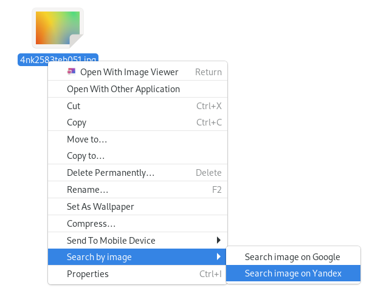

# Reverse image search for Nautilus

Nautilus plugin that adds contextual menu entries on image files to do a reverse image search on them using Google or Yandex.



## Installation

### Arch Linux

Install `nautilus-search-by-image-git` from AUR.

### Manual

Install the `python-nautilus` and `python-requests` packages.

Place the search-by-image.py file in the nautilus-python user or system directory and restart Nautilus.

For example, to place it in the user directory (usually ~/.local/share/nautilus-python/extensions):
```shell
EXTDIR="${XDG_DATA_HOME-${HOME}/.local/share}/nautilus-python/extensions"
mkdir -p "${EXTDIR}"
cp search-by-image.py "${EXTDIR}"/search-by-image.py
nautilus -q
```

## Caveats

When doing a search, your image is uploaded to a file sharing service (defaults to transfer.sh, can be changed by editing the `UPLOAD_URL` variable), so in addition to the search engine this file sharing service also gets to access the image you're searching.
